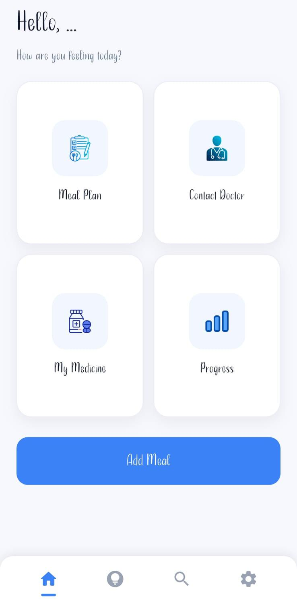
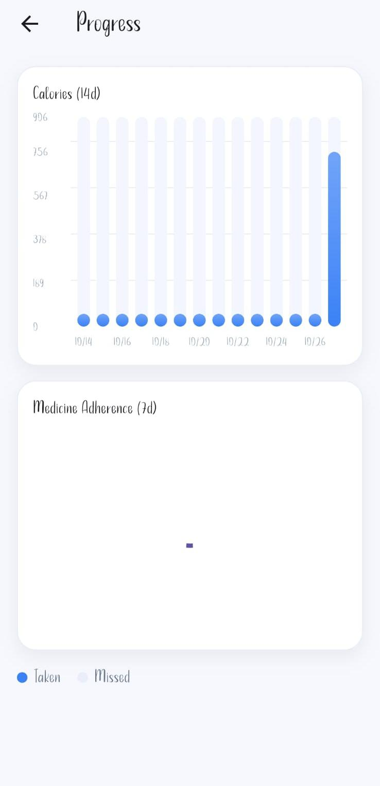
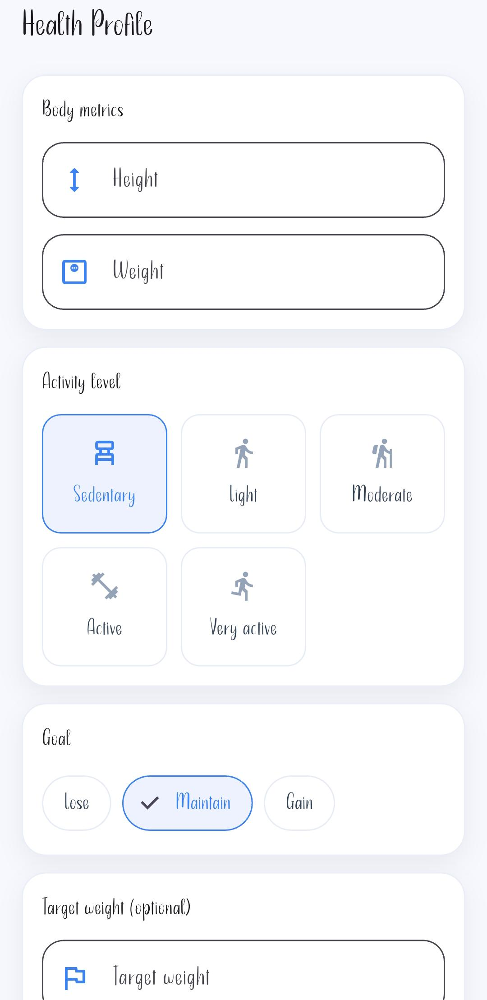
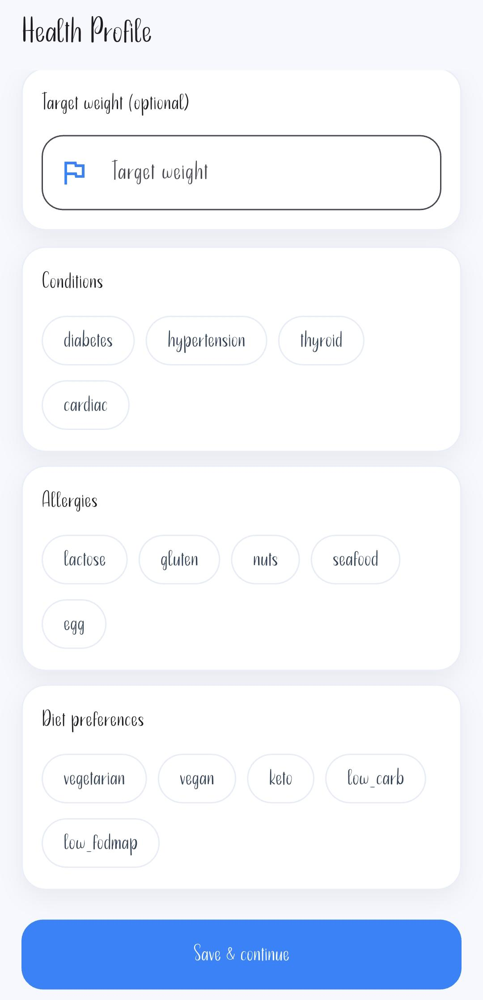
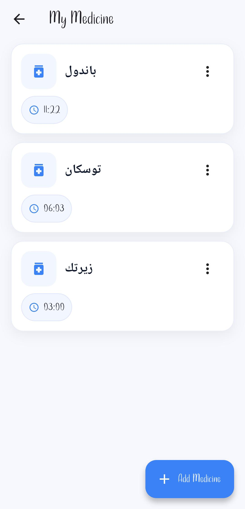
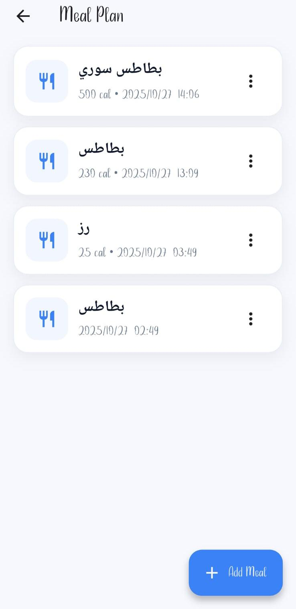
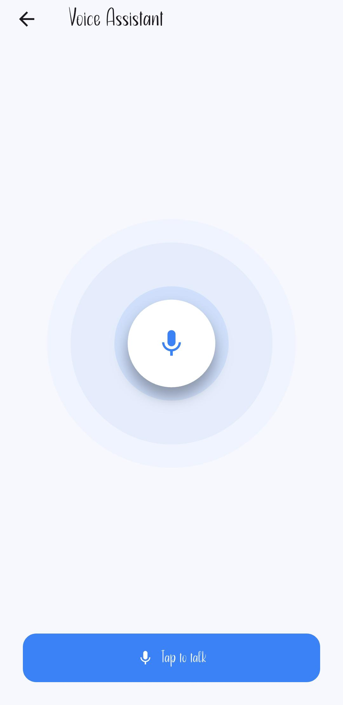

  

<h1 align="center">🩺 Clinico</h1>

AI-Powered Healthcare Mobile Application

🩺 Clinico

An open-source healthcare application built with Flutter that helps users manage their healthcare efficiently. Clinico combines medication reminders, appointment scheduling, AI-powered assistance, and healthcare services in one easy-to-use mobile application.

✨ Features

- 💊 Medication reminders
- 📅 Appointment scheduling
- 🤖 AI-powered voice assistant
- 👨‍⚕️ Doctor finder
- 💊 Pharmacy locator
- 🔔 Smart notifications
- 📱 Clean and user-friendly interface

🛠️ Technologies Used

- Flutter
- Dart
- Firebase
- AI Integration

🚀 Getting Started

Clone the repository

git clone https://github.com/mostafaahmd/clinico.git

Install dependencies

flutter pub get

Run the application

flutter run

📂 Project Structure

lib/
├── screens/
├── widgets/
├── models/
├── services/
├── providers/
└── main.dart

🎯 Future Improvements

- Online doctor consultations
- AI-based health recommendations
- Electronic medical records
- Emergency support
- Health analytics dashboard

🤝 Team

Developed by:

- Mostafa Ahmed Mansour
- Rokia Sameh Mahmoud

📸 Screenshots
| Home Page | Health Dashboard |
|-----------|------------------|
|  |  |

| Health Profile | Health Profile (Details) |
|----------------|--------------------------|
|  |  |

| Medicine Plan | Meal Plan |
|---------------|-----------|
|  |  |

| Voice Assistant |
|-----------------|
|  |

⭐ Support

If you like this project, please consider giving it a ⭐ on GitHub.

📄 License

This project is licensed under the MIT License.
